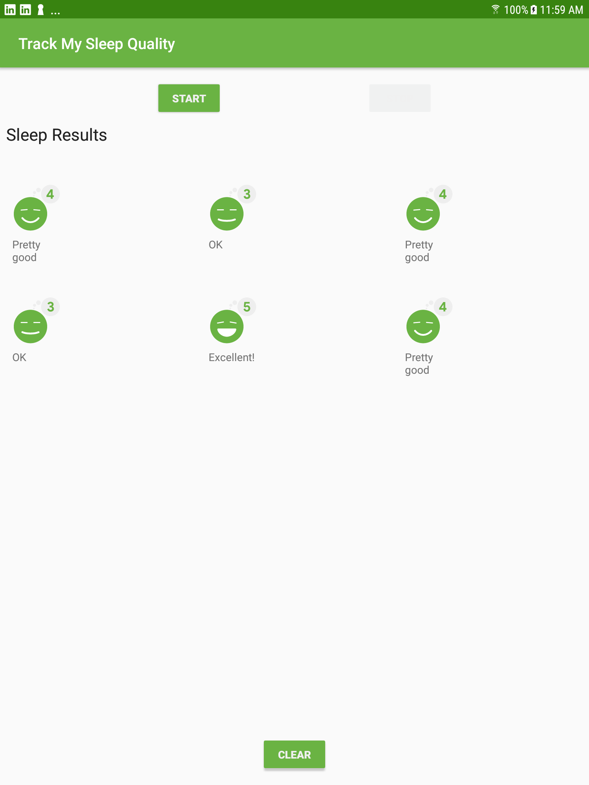

# SleepQualityTracker with RecyclerView app
Sleep Quality Tracking App made with Kotlin

## Concepts involved

- RecyclerView
- Fragments
- Data binding in Adapters
- ViewHolders
- DiffUtil

## Screenshots

